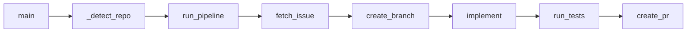

# Pipeline Happy-Path Stages Design

**Issue:** #10
**Branch:** `feat/pipeline-happy-path`
**Date:** 2026-04-03

## Goal

Enable `uv run python pipeline.py <issue-number>` to process a simple issue end-to-end and automatically create a PR. This implements the minimal flow from `docs/design.md` section 2.2, skipping plan/review stages.

## Approach

Single-file approach: add all stage functions, `run_pipeline()`, and `main()` to the existing `pipeline.py`. This keeps the implementation within the design doc's 200-300 line target and avoids premature module splitting (YAGNI).

## Pipeline Flow



`run_pipeline` wraps stages in `try/finally` for worktree cleanup. Each stage mutates `PipelineContext` in-place. No retry logic — fail loud on any error.

## Data Flow (PipelineContext mutations)

```
main()
  ctx = PipelineContext(issue_number, repo)

fetch_issue(ctx)
  ctx.issue_title = "..."
  ctx.issue_body = "..."

create_branch(ctx)
  ctx.worktree_path = "../code-sherpa-worktrees/issue-{N}"
  ctx.branch_name = "feat/issue-{N}"

implement(ctx)
  load_prompt("implement.md", plan=f"{title}\n\n{body}", last_error="")
  run_agent(prompt, cwd=ctx.worktree_path)

run_tests(ctx)
  ruff check -> ruff format --check -> pytest (in worktree)

create_pr(ctx)
  git add -> commit -> push -> gh pr create
```

## Stage Specifications

### `_detect_repo() -> str`

- Return `CODE_SHERPA_REPO` env var if set (for testing/CI)
- Otherwise run `gh repo view --json nameWithOwner -q .nameWithOwner` and strip

### `fetch_issue(ctx: PipelineContext) -> None`

- Run `gh issue view {issue_number} --repo {repo} --json title,body`
- Parse JSON, set `ctx.issue_title` and `ctx.issue_body`

### `create_branch(ctx: PipelineContext) -> None`

- `git fetch origin main`
- `git worktree add -b feat/issue-{N} ../code-sherpa-worktrees/issue-{N} origin/main`
- **Must use `origin/main` as base** — independent of current branch (Codex review finding)
- Set `ctx.worktree_path` and `ctx.branch_name`

### `implement(ctx: PipelineContext) -> None`

- Build plan from issue: `plan = f"{ctx.issue_title}\n\n{ctx.issue_body}"`
- Load prompt: `load_prompt("implement.md", plan=plan, last_error=ctx.last_error)`
- Execute: `run_agent(prompt, cwd=ctx.worktree_path)`
- Agent output is not captured — agent modifies files directly in worktree

**Design decision:** Reuse existing `implement.md` template (which expects `{{plan}}`). Pass issue content as `plan` variable instead of creating a separate template. When plan stage is added later, the real plan will replace this.

### `run_tests(ctx: PipelineContext) -> None`

Run sequentially in worktree:
1. `uv run ruff check .`
2. `uv run ruff format --check .`
3. `uv run pytest`

Any failure raises RuntimeError via `run_cmd`.

### `create_pr(ctx: PipelineContext) -> None`

Run sequentially in worktree:
1. `git add -A`
2. `git commit -m "feat: implement issue #{ctx.issue_number}"`
3. `git push -u origin {ctx.branch_name}`
4. `gh pr create --repo {repo} --title "feat: {ctx.issue_title}" --body "Closes #{ctx.issue_number}\n\nAutomated by code-sherpa pipeline."`

### `run_pipeline(issue_number: int, repo: str) -> None`

```python
def run_pipeline(issue_number: int, repo: str) -> None:
    ctx = PipelineContext(issue_number=issue_number, repo=repo)
    fetch_issue(ctx)
    create_branch(ctx)
    try:
        implement(ctx)
        run_tests(ctx)
        create_pr(ctx)
    finally:
        if ctx.worktree_path:
            run_cmd(["git", "worktree", "remove", "--force", ctx.worktree_path])
```

- `fetch_issue` and `create_branch` are outside `try` — no worktree to clean up if they fail
- `finally` guarantees worktree cleanup (B6 fix)

### `main() -> None`

- Validate `sys.argv` — exactly 1 argument required
- Parse issue number as int — `SystemExit(1)` on `ValueError` (B8 fix)
- Call `_detect_repo()` then `run_pipeline()`

## Additional Imports

```python
import os    # _detect_repo: os.environ.get
import sys   # main: sys.argv
```

## Test Design

All tests mock at the `run_cmd` / `run_agent` boundary — no `subprocess.run` mocking needed (already covered by core utility tests). Tests are added to existing `tests/test_pipeline.py`.

| Test | Verifies |
|------|----------|
| `test_detect_repo_env_var` | Returns `CODE_SHERPA_REPO` env var when set |
| `test_detect_repo_gh_command` | Runs `gh repo view` and strips stdout when env var unset |
| `test_fetch_issue` | Parses gh JSON output, sets `ctx.issue_title` / `ctx.issue_body` |
| `test_create_branch` | Runs `git fetch` then `git worktree add` with `origin/main` base; sets ctx fields |
| `test_implement` | Passes `plan="{title}\n\n{body}"` to `load_prompt`; calls `run_agent` with worktree cwd |
| `test_run_tests` | Runs ruff check, ruff format --check, pytest in order with worktree cwd |
| `test_create_pr` | Runs git add, commit, push, gh pr create in order with worktree cwd |
| `test_run_pipeline_success` | All stages mocked; `git worktree remove` called at end |
| `test_run_pipeline_cleanup_on_failure` | `implement` raises; `git worktree remove --force` still called |
| `test_main_invalid_args` | No args / non-numeric arg -> `SystemExit(1)` |

## Files Modified

| File | Action | Content |
|------|--------|---------|
| `pipeline.py` | Modify | Add stage functions, `run_pipeline()`, `main()`, imports (`os`, `sys`) |
| `tests/test_pipeline.py` | Modify | Add 10 test cases for new functions |

## Constraints

- **Excludes:** plan/review stages, code review stage, retry logic, observation logging (JSONL)
- No retry — fail immediately on error
- smoke_test omitted (YAGNI)

## Done Criteria

- [ ] `uv run python pipeline.py <issue-number>` completes end-to-end on a simple issue (manual test)
- [ ] Worktree cleanup on failure verified by test
- [ ] `ruff check` + `ruff format --check` + `mypy --strict` + `pytest` pass
- [ ] `git diff` shows no unintended changes
